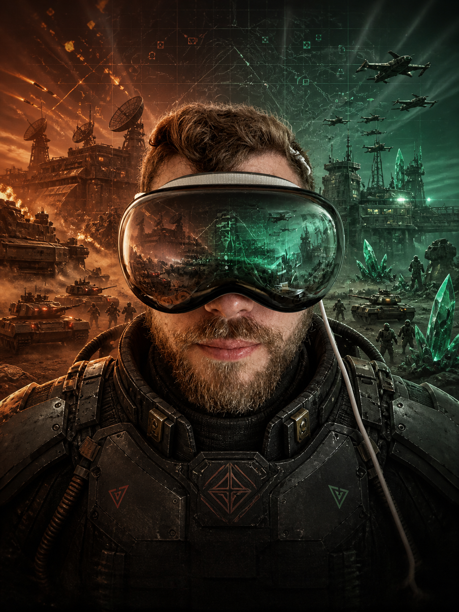

# Tiberian Dawn for Apple Vision Pro



The repository contains two deliberately separate Vision Pro paths:

1. the existing iPad app running in Apple's **Designed for iPad** compatibility
   environment; and
2. an arm64 **native visionOS command-window prototype** built from the same
   engine, Metal renderer, AVAudioEngine backend, importer, saves, localization,
   controls, modern-art resources, and networking code.

Neither path includes original Command & Conquer game data. Supply legally
owned C&C Gold GDI and Nod disc images through the system importer.

## Native simulator build

Requirements: Xcode with the visionOS SDK and CMake 3.28 or newer.

```sh
./scripts/build-visionos-simulator.sh
```

The generated Xcode project is
`build/visionos-simulator/TiberianDawnApple.xcodeproj`; the Debug application is
written to
`/private/tmp/TiberianDawnApple-Vision-Simulator-Products/Debug/TiberianDawn.app`.

For an unsigned device compile without installing on a headset:

```sh
./scripts/build-visionos-device.sh
```

Signing remains local. Set `VISIONOS_DEVELOPMENT_TEAM` in an untracked
`CMakeUserPresets.json` or in Xcode; never commit a team ID, provisioning
profile, certificate, or credential.

## Native controls

The command window uses visionOS system gestures rather than treating gaze and
pinch as iPad touch input:

- look at a unit, command, or menu entry and pinch once to primary-click it;
- pinch-drag from empty terrain to draw the normal multi-unit selection box;
- on visionOS 26 or newer, look toward an edge of the tactical map to scroll
  it through the system's privacy-preserving Look to Scroll interaction;
- while drawing a multi-unit selection box, move the pinch toward an edge to
  scroll beyond the currently visible map without releasing the selection;
- alternatively, look near a map edge and hold the pinch for 0.4 seconds to
  scroll; while holding, move between edge regions to steer or move back into
  the center to pause scrolling;
- hold the pinch over the central game area to invoke the classic secondary
  click/cancel action; and
- pinch once during a skippable cutscene to skip it, like Escape.

Editable game fields, including the Hall-of-Fame/high-score name after a
mission, request the visionOS spatial keyboard automatically. A dismissed
keyboard can be requested again by pinching the visible entry row.

Mouse, trackpad, hardware keyboard, and supported controllers remain available. The app
never receives raw eye-tracking data: gaze chooses the target that visionOS
delivers when a system gesture begins. Gaze alone therefore does not issue a
game command. The only gaze-only action is system-managed map scrolling on
visionOS 26 or newer; the app receives scroll deltas, never an eye position.

The **Visual Controls** dialog contains four native Vision Pro adjustments:
Look to Scroll on/off, scroll speed, edge sensitivity, and selection tolerance.
Scroll acceleration increases smoothly toward the edge, while a wider exit
band prevents accidental start/stop jitter. The forgiving selection setting
adds a small game-coordinate margin around the classic selection rectangle; it
does not alter unit hit testing or simulation rules.

## Current acceptance level

The native target is a prototype, not a downloadable release. Simulator and CI
compilation can prove source/build integration, but they cannot prove gaze and
pinch comfort, headset removal, spatial audio, thermals, focus behavior, or
long-session reliability. A physical Vision Pro must pass the V1 matrix before
the project describes the native build as supported.

Verified on 14 August 2026 with Xcode 26.5: the native arm64 simulator app and
the unsigned arm64 device app both compile and link. The app has also launched
on a physical Apple Vision Pro, imported the Gold data, and entered gameplay.
That hardware run exposed unreliable selection, scrolling, and cutscene input
in the original compatibility-style event path. The replacement now uses
native UIKit tap, pan, and long-press recognizers, keeps the logical cursor
authoritative throughout a drag, and balances every press/release transition.
Selection drags can now scroll at the map edge with proximity-based speed and
hysteresis, and visionOS 26 adds system-managed Look to Scroll over the
tactical viewport. Automated tests cover selection edge scrolling, all eight
directions, hysteresis, speed levels, cancellation, taps, secondary click, and
resetting an interrupted gesture stream when missions or multiplayer dialogs
flush the classic input queue. The physical acceptance matrix repeats the full
control set after a campaign mission transition and in skirmish and multiplayer.
Simulator compilation, startup, menu rendering, and gesture-event delivery
pass; comfort and the gameplay gestures above still require one
physical-headset re-test before the native target is described as supported.

The pinned SDL 2.32.10 checkout is prepared reproducibly in two stages:
`SDL2-ipados.patch` supplies the shared UIKit lifecycle and input work, then
`SDL2-visionos.patch` adds guarded visionOS window/Metal compatibility. The
visionOS preparation script is idempotent and applies both in that order.

The optional Modern artwork path is shared with iPadOS and macOS. In addition
to the cursor, Buggy, Humvee and standard infantry, it contains separate GDI
and Nod MCVs, Power Plants, infantry-production buildings and Construction
Yards. Native visionOS packages the same atlases and applies the same Fog of
War, health, selection, scrolling, modal-menu and continuous building-state
rules, including modern Construction-Yard and infantry-production activity
animations.

The compatibility iPad build has reached startup, local-data recognition,
video, resizing, and input-event diagnostics in Vision Simulator. A live
mission plus the complete physical-headset matrix remains a manual gate.

See [the full Vision Pro concept](docs/VISIONOS-CONCEPT.md) and
[Apple-platform parity policy](docs/PLATFORM_PARITY.md).
