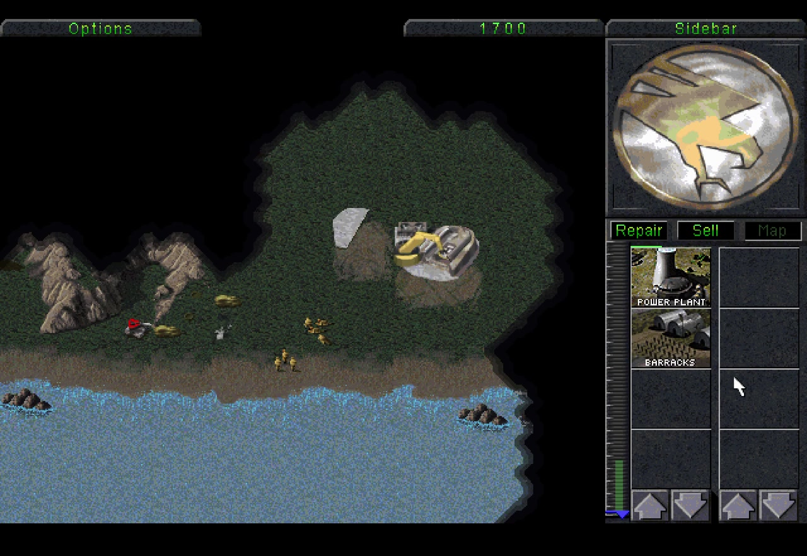

# Tiberian Dawn for iPad and macOS

> **EA has not endorsed and does not support this product.**

**Command & Conquer: Tiberian Dawn (1995), running natively on iPadOS and
macOS** through an unofficial, community-made engine port. The project is based on
[Vanilla Conquer](https://github.com/TheAssemblyArmada/Vanilla-Conquer) and the
source code released by Electronic Arts.

> **Independent modified project.** Tiberian Dawn for iPad and macOS is not an Electronic
> Arts product and is not affiliated with Electronic Arts. Command & Conquer
> and related names are Electronic Arts trademarks. They are used in plain text
> only to identify the game this port is for and the data it is compatible with.

The repository contains **source code and project presentation media only**.
It does not contain the game, disc images, or any original data files needed to
run it. You must supply data from C&C Gold GDI and Nod discs that you are
legally entitled to use.

[Project page](https://cesarus85.github.io/Tiberian-Dawn-for-iPad-and-macOS/) · [iPad build guide](README-iPadOS.md) ·
[macOS build guide](README-macOS.md) · [Roadmap](IPADOS-ROADMAP.md) · [License](License.txt)

## Gameplay on iPad

[](https://cesarus85.github.io/Tiberian-Dawn-for-iPad-and-macOS/#gameplay)

[Watch the 63-second gameplay video](https://cesarus85.github.io/Tiberian-Dawn-for-iPad-and-macOS/#gameplay),
including launch, menus, a mission briefing, and touch-driven gameplay on a
physical iPad. The preview uses game data supplied by the device owner; no
original game data is distributed with this repository.

## Highlights

- Native iPad window lifecycle, rotation, safe areas, and Stage Manager layout
- Touch-first RTS controls, mouse and trackpad, hardware keyboard, controllers,
  and Apple Pencil support
- Guided on-device import of the GDI and Nod C&C Gold disc images
- Self-contained Universal 2 macOS app for Apple Silicon and Intel, with a
  guided local two-disc importer and no Homebrew runtime dependency
- Files-visible manual saves plus transactional interruption recovery
- 60 FPS presentation with a persistent 30 FPS battery mode
- Built-in resolution and presentation scaler with full-size sharp and integer
  pixel-perfect modes, preserving the original 640 × 400 aspect ratio
- Metal-accelerated SDL rendering
- iPadOS audio-session handling for interruptions and route changes
- No analytics, accounts, or advertising

The original campaigns, missions, videos, audio, and languages come from the
user-supplied game data. Multiplayer is work in progress and planned for a
later development stage; networking remains disabled in the current build.

## What this port involved

The original engine assumes a desktop window, mouse, writable working
directory, long-lived foreground process, and desktop audio device. The iPad
port adds the platform behavior around that engine while preserving its game
logic and original 640 × 400 presentation:

- UIKit scene lifecycle and safe-area-aware SDL windows for rotation and Stage
  Manager
- A touch gesture state machine that distinguishes taps, selection drags,
  two-finger map movement, long presses, cancellation, and Pencil input
- Sandboxed paths for imported assets, settings, saves, and recovery state
- Atomic two-disc import with validation, storage checks, and actionable errors
- Render suspension, dirty-frame presentation, battery and thermal policies
- iPad audio-session coordination and interruption-safe mission recovery

This was developed as a human + AI collaboration: product direction, device
testing, visual judgment, and release decisions are human-led; implementation,
diagnostics, documentation, and repetitive validation were AI-assisted.

## Current status

The physical-iPad build starts, imports complete C&C Gold GDI and Nod data,
plays campaigns and live missions, saves and resumes, rotates, and works in
Stage Manager. Touch, Pencil, mouse/trackpad, keyboard, and controller paths are
implemented. The Universal 2 macOS package has been tested from a clean archive
through local ISO import, videos, menus, mouse input, campaign launch, and a live
mission. Both remain source-built projects rather than App Store distributions.

## Open in Xcode and run on a physical iPad

Requirements:

- A Mac with Xcode and the iOS platform components installed
- CMake 3.25 or newer
- A free or paid Apple ID available in Xcode for personal-device signing

Download the source archive or clone the repository. On the Mac, double-click:

```text
Open Tiberian Dawn for iPad.command
```

The setup verifies Xcode and CMake, retrieves only the project-pinned official
SDL2 revision when it is missing, applies the checked-in iPad patch, generates
the current Xcode project, and opens it. It does not request administrator
access, install packages, alter Apple credentials, or access game data.

In Xcode, select the `TiberianDawn` scheme, choose your Apple Development Team
under Signing & Capabilities, select the connected iPad, and press Run. The
detailed [iPadOS guide](README-iPadOS.md) also covers the manual developer
workflow, first launch, data import, controls, storage, and diagnostics.

## Game-data import

On first launch, choose the original C&C Gold **GDI and Nod ISO files together**
in the system document picker. The app validates both discs, extracts the data
locally, and does not retain the ISO files. A previously prepared data directory
can be selected instead.

The importer does not support data from the Remastered Collection, The First
Decade, or The Ultimate Collection. No game data may be submitted to this
repository in issues, pull requests, test fixtures, or releases.

## Build and run on macOS

The supported macOS source build produces a self-contained Universal 2 app for
Apple Silicon and Intel Macs running macOS 11 or newer. Double-click `Build
Tiberian Dawn for macOS.command`; it verifies Xcode, CMake, and the pinned SDL2
source, then creates `dist/Tiberian-Dawn-macOS-universal.zip`. Unzip it and open
`Tiberian Dawn.app`. No Homebrew libraries, administrator access, Apple account,
or original game files are used during compilation.

On first launch, the bilingual importer accepts the GDI and Nod Gold ISOs either
together or one after the other. See the complete [macOS guide](README-macOS.md)
for paths, signing details, and the manual build command.

## Known limitations

- Multiplayer is work in progress for a later development stage; networking is
  disabled in the current build.
- Red Alert is present in the upstream source tree but is not a supported Apple
  app target in this project.
- External-display behavior is not release-tested.
- Original game limitations and content are unchanged; this project does not
  provide replacement assets or translations.

## Project lineage and credits

- Westwood Studios and Electronic Arts — the original game and released source
- [Electronic Arts C&C source release](https://github.com/electronicarts/CnC_Remastered_Collection)
- [Vanilla Conquer](https://github.com/TheAssemblyArmada/Vanilla-Conquer) — the
  portable engine foundation used by this fork
- SDL contributors — platform, rendering, and input foundation
- unshieldv3 contributors — InstallShield archive extraction used by the guided
  importer
- Tiberian Dawn for iPad and macOS contributors — Apple integration, controls,
  importer, lifecycle, storage, performance, and documentation

See [THIRD_PARTY_NOTICES.md](THIRD_PARTY_NOTICES.md) for license details.

## Contributing

Please read [CONTRIBUTING.md](CONTRIBUTING.md) before opening a pull request.
Keep changes focused, mark modified source clearly, and never include original
game data or confidential signing material. Security reports belong in the
private channel described in [SECURITY.md](SECURITY.md).

## License and notices

The code is distributed under GNU GPL v3 or later with the permitted additional
terms in [License.txt](License.txt). Those additional terms include trademark,
attribution, modification-marking, and warranty provisions. See
[NOTICE.md](NOTICE.md) for the modification statement and
[THIRD_PARTY_NOTICES.md](THIRD_PARTY_NOTICES.md) for bundled dependencies.

No warranty is provided. This repository is intended for preservation,
portability research, and lawful personal use of independently supplied game
data.
