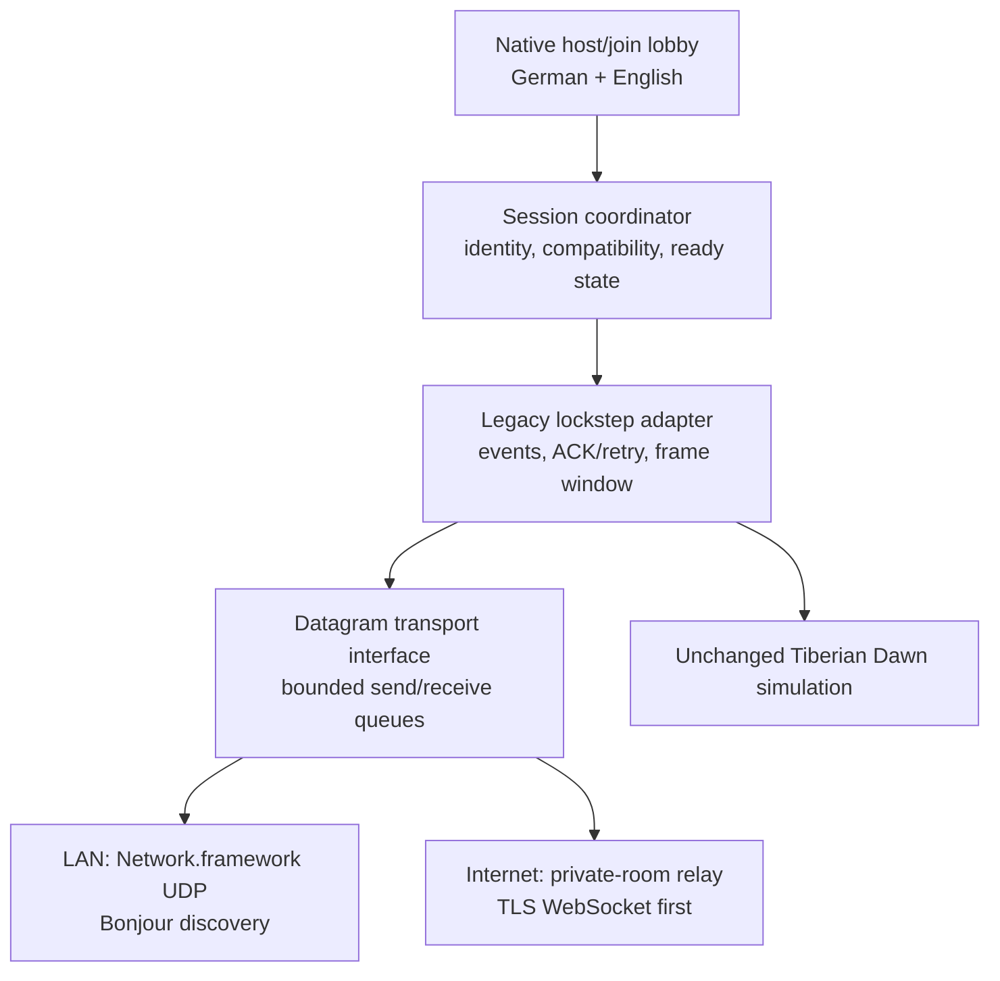

# Multiplayer architecture and implementation plan

Status: approved design direction; networking remains disabled in release
builds until the LAN acceptance gate is complete.

## Product goal

The first multiplayer release should make the original Tiberian Dawn network
game practical on modern Apple devices without changing combat rules,
simulation timing, maps, unit statistics, or save formats.

The target experience is:

- cross-play between iPadOS, macOS, and a future native visionOS target;
- two to six human players, matching the original game limits;
- a simple local-network flow first, followed by private Internet rooms;
- German and English native setup screens around the original match UI;
- no account, analytics, advertising, public player directory, or game-data
  upload;
- explicit compatibility checks so mismatched builds, maps, data, or optional
  modifications cannot silently desynchronize a match.

Skirmish against the existing AI remains single-player. Spectators, ranked
matchmaking, reconnecting into a running simulation, host migration, public
chat rooms, multiplayer save/restore, and anti-cheat are deliberately outside
the first release.

## What the source already contains

Tiberian Dawn already has a deterministic peer-to-peer lockstep model. Player
commands are queued for a future simulation frame, distributed to the peers,
and executed in the same order on every machine. The relevant code is not a
blank slate:

- `tiberiandawn/conquer.cpp` services network commands and frame progress;
- `tiberiandawn/netdlg.cpp` contains discovery, host, join, lobby, reconnect,
  and match-setup flows;
- `tiberiandawn/ipxmgr.*`, `ipxconn.*`, and `ipxgconn.*` adapt the game to the
  old IPX-shaped connection manager;
- `common/connect.*` and `common/combuf.*` already provide packet sequencing,
  acknowledgement, retry, duplicate handling, and bounded queues;
- `common/wsproto.*` and `common/wspudp.*` contain a partial POSIX/UDP port of
  the former Winsock transport.

All Apple presets currently set `NETWORKING=OFF`. This is intentional: simply
turning the option on would expose old assumptions, unversioned wire
structures, broadcast discovery, and UI that has not been validated on modern
Apple lifecycle rules.

## Chosen architecture

The simulation remains peer-to-peer lockstep. A new transport-neutral boundary
sits below the existing connection manager, and native Apple networking sits
below that boundary.

Network callbacks never invoke engine code. They append validated messages to
a bounded queue; the game thread drains that queue at the same polling point it
uses today. This preserves determinism and removes thread races from the
simulation.

### Shared C++ boundary

Add a small interface below `common/`, with operations equivalent to:

- start and stop a transport;
- advertise, browse, connect, and disconnect;
- send one message to a peer or all established peers;
- poll received messages and connection-state changes;
- expose measured round-trip time and loss without exposing platform socket
  types to the engine.

Peer IDs are random fixed-width values created for a lobby. Raw pointers,
`sockaddr` layouts, IPX headers, and compiler-dependent C++ structures must
never become the new public wire format.

The adapter initially carries the legacy game payload unchanged inside a
versioned envelope. Once two original peers work reliably, each payload type
is audited and converted to explicit-width, little-endian serialization. Every
decoder checks envelope size, payload type, player ID, session ID, protocol
version, and maximum length before allocating or copying data.

### LAN transport

The first shipping transport uses Apple's Network framework:

- a specific Bonjour service such as `_tibdawn._udp` for host discovery;
- `NWBrowser` and `NWListener` for discoverable games;
- unicast UDP between established peers for match traffic;
- `NSLocalNetworkUsageDescription` and the advertised service in
  `NSBonjourServices` for iPadOS and visionOS;
- no IP broadcast scan and no arbitrary service browsing.

This keeps discovery understandable to the player and avoids depending on the
legacy broadcast code. Whether Apple's multicast entitlement is necessary must
be verified with the final discovery implementation and provisioning profile;
it must not be requested speculatively.

### Internet transport

Internet play is a second milestone, not a condition for enabling LAN play.
The first Internet beta uses a tiny open-source rendezvous and relay service:

- the host receives a short, expiring room code;
- joining requires the code and a high-entropy room secret embedded in the
  invitation;
- clients connect over TLS using a message-oriented WebSocket;
- the relay authenticates room membership, limits message size/rate, and
  forwards opaque binary messages; it never receives maps or original game
  data and does not run the simulation;
- rooms expire automatically and no public player list is provided.

WebSocket is selected for the first correctness-focused beta because it is
available across the project's current Apple deployment targets and works
through NAT without third-party client libraries. Its head-of-line behavior
must be measured under packet loss. A QUIC-datagram relay can replace it later
if measurements show a gameplay benefit and the supported operating-system
floor permits it.

Direct Internet peer-to-peer, NAT traversal, and Game Center matchmaking remain
optional later work. Game Center must not become the only way to play because
local and independently distributed Mac builds also need a usable path.

## Player experience

The disabled main-menu item becomes active only in builds that pass the LAN
gate. Selecting it opens a native, accessible screen:

1. Choose `Local Network` or, after its beta ships, `Private Internet Room`.
2. Enter a persistent local player name.
3. Choose `Host Game` or select a discovered game / enter a room code.
4. In the lobby, the host selects map and original match options; every player
   chooses color/side and marks ready.
5. The Start button stays disabled while a peer is incompatible, still loading,
   or not ready. The reason is shown next to that peer.
6. Once launched, the original game UI and simulation own the match.

The lobby shows latency and connection health without exposing IP addresses.
Text chat, if retained, is limited to the private lobby and match. Player names
and chat are untrusted UTF-8 input: enforce length limits, strip control
characters, and safely map unsupported characters into the classic font.

## Compatibility and determinism contract

Before readying, every peer exchanges and agrees on:

- protocol major/minor version and application build ID;
- engine determinism version;
- map identifier plus SHA-256 of the exact scenario bytes;
- hashes of simulation-relevant rules/data files;
- enabled expansion and optional modification identifiers;
- player count and complete host-selected match settings;
- negotiated input-delay and maximum-ahead values.

Presentation-only choices such as sharp/pixel-exact/classic scaling, modern
artwork, cursor size, language, and visionOS immersion never enter the
determinism hash.

During a match, calculate a lightweight deterministic state checksum at fixed
frame intervals. Peers exchange only the checksum and frame number. A mismatch
pauses the match, records a diagnostic bundle without game assets, and ends the
session cleanly rather than allowing divergent worlds to continue.

## Lifecycle and failure policy

The engine cannot continue a lockstep match while one mobile process is
suspended. Therefore:

- opening Control Center, removing the headset, backgrounding, or losing focus
  sends a pause request immediately;
- all peers stop at an agreed future frame and show who interrupted play;
- the connection remains eligible for a short grace period;
- returning before the deadline resumes at an agreed frame;
- expiry or process termination ends the match for the first release;
- a network path change may reconnect the transport during the grace period,
  but the player never joins a simulation that advanced without them.

The host has setup authority, not simulation authority. Once a match starts,
all peers remain equal. A relay outage or host departure therefore ends the
first-release match; invisible host migration is not attempted.

## Security and privacy requirements

- Treat every network byte as hostile; validate before parsing or queueing.
- Cap packet length, queue depth, peers per room, discovery records, retry rate,
  and chat length.
- Fuzz every decoder and run it under AddressSanitizer/UndefinedBehaviorSanitizer.
- Never deserialize native pointers, object layouts, file paths, or arbitrary
  filenames from a peer.
- Never transfer maps or commercial game data. A mismatch tells the player to
  install the same legally owned data locally.
- Encrypt Internet traffic and authenticate room membership. LAN traffic may
  remain local unicast in the first prototype, but a release decision must
  explicitly assess DTLS rather than assuming a trusted Wi-Fi network.
- Store no room history, IP address, chat, or player name in analytics. The
  project continues to have no analytics.
- Publish the relay source, protocol version, retention policy, and deployment
  instructions before calling Internet play stable.

This is cooperative lockstep among trusted participants, not a cheat-resistant
competitive service. A modified client can cheat or deliberately desynchronize
a match; the project should state that plainly rather than claiming server
authority it does not have.

## Implementation milestones and gates

### M0 — compile and protocol audit

- Add an internal Apple networking preset without changing release presets.
- Compile all `NETWORKING` sources on arm64 macOS first.
- Inventory every transmitted structure, size assumption, global, endian
  conversion, and direct dependency on IPX/Winsock/window messages.
- Record golden packet fixtures from a loopback match.

Gate: networking code compiles with warnings treated as errors and the audit
lists every wire payload.

### M1 — deterministic loopback

- Introduce the shared transport interface and an in-memory backend.
- Run two isolated game processes against a deterministic virtual network.
- Inject delay, jitter, loss, duplication, reordering, queue pressure, and
  disconnects.
- Add state-checksum and compatibility-handshake tests.

Gate: repeated two-player matches remain checksum-identical with a fixed seed,
including impaired-network tests.

### M2 — Apple LAN alpha

- Implement the Network.framework UDP/Bonjour backend in `platform/apple`.
- Add localized local-network permission text and native host/join/lobby UI.
- Support macOS-to-macOS first, then Mac-to-iPad, then iPad-to-iPad.
- Add pause/graceful-disconnect behavior for mobile lifecycle events.

Gate: two-player and maximum-player LAN matches pass a 60-minute soak across
all supported Apple combinations with no desync, leaked peer, stuck lobby, or
unbounded queue.

### M3 — LAN beta

- Harden malformed-packet handling, diagnostics, accessibility, keyboard and
  touch lobby flows.
- Test Wi-Fi changes, denied/revoked local-network permission, duplicate names,
  sleep/wake, app switching, and joining incompatible data.
- Document firewall and privacy behavior.

Gate: release presets may set `NETWORKING=ON` and remove the disabled placeholder
only after CI builds every Apple target and the physical-device matrix passes.

### M4 — private Internet rooms

- Publish and deploy the minimal relay.
- Add room creation/joining, expiry, rate limits, TLS, and operational health
  monitoring without player analytics.
- Test realistic latency, jitter, loss, cellular/Wi-Fi transitions, relay
  restart, regional distance, and denial-of-service limits.

Gate: an Internet beta is labeled separately from stable LAN play; LAN never
depends on relay availability.

### M5 — future options

- QUIC datagrams if measurement justifies them;
- invite links, optional Game Center discovery, SharePlay lobby presence;
- reconnect snapshots, host migration, spectators, replays, or multiplayer
  save/restore only as separately designed projects.

## Required automated and physical tests

- serializer round trips and golden cross-version fixtures;
- malformed-length, truncated, oversized, reordered, duplicate, and fuzzed
  packet tests;
- deterministic dual-process integration test with per-frame checksums;
- protocol mismatch, map/data mismatch, full lobby, duplicate identity, and
  ready-state tests;
- simulated 0–10% loss, 20–500 ms latency, jitter, bursts, and disconnects;
- macOS firewall and multiple-interface tests;
- iPad and visionOS permission denial, background/suspend, thermal, and route
  change tests;
- mixed iPadOS/macOS/visionOS soak after the visionOS target exists;
- App Store privacy-label and entitlement review before distribution.

## Apple references

- [Understanding local network privacy](https://developer.apple.com/documentation/technotes/tn3179-understanding-local-network-privacy)
- [`NSLocalNetworkUsageDescription`](https://developer.apple.com/documentation/bundleresources/information-property-list/nslocalnetworkusagedescription)
- [`NSBonjourServices`](https://developer.apple.com/documentation/bundleresources/information-property-list/nsbonjourservices)
- [Network framework connections and listeners](https://developer.apple.com/documentation/network/nwconnection)
- [`URLSessionWebSocketTask`](https://developer.apple.com/documentation/foundation/urlsessionwebsockettask)
- [QUIC options in Network framework](https://developer.apple.com/documentation/network/quic-options)
