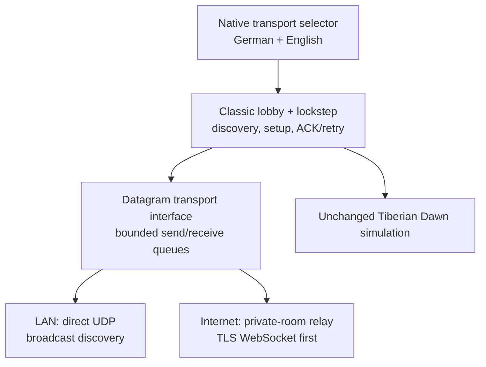

# Multiplayer architecture and implementation plan

Status: shared Apple beta implemented. Local UDP play and private Internet
rooms are enabled in the iPadOS and macOS presets. Protocol, relay, TLS
production smoke, macOS, iPad simulator and unsigned iPad device builds are
automated; extended physical-device and maximum-player soak remains the final
stability gate before calling the feature non-beta.

## Product goal

The first multiplayer release should make the original Tiberian Dawn network
game practical on modern Apple devices without changing combat rules,
simulation timing, maps, unit statistics, or save formats.

The target experience is:

- cross-play between iPadOS, macOS, and a future native visionOS target;
- two to six human players, matching the original game limits;
- a simple local-network flow first, followed by private Internet rooms;
- German and English native setup screens around the original match UI;
- no account, analytics, advertising, public player directory, or game-data
  upload;
- explicit compatibility checks so mismatched builds, maps, data, or optional
  modifications cannot silently desynchronize a match.

Skirmish against the existing AI remains single-player. Spectators, ranked
matchmaking, reconnecting into a running simulation, host migration, public
chat rooms, multiplayer save/restore, and anti-cheat are deliberately outside
the first release.

## What the source already contains

Tiberian Dawn already has a deterministic peer-to-peer lockstep model. Player
commands are queued for a future simulation frame, distributed to the peers,
and executed in the same order on every machine. The relevant code is not a
blank slate:

- `tiberiandawn/conquer.cpp` services network commands and frame progress;
- `tiberiandawn/netdlg.cpp` contains discovery, host, join, lobby, reconnect,
  and match-setup flows;
- `tiberiandawn/ipxmgr.*`, `ipxconn.*`, and `ipxgconn.*` adapt the game to the
  old IPX-shaped connection manager;
- `common/connect.*` and `common/combuf.*` already provide packet sequencing,
  acknowledgement, retry, duplicate handling, and bounded queues;
- `common/wsproto.*` and `common/wspudp.*` contain a partial POSIX/UDP port of
  the former Winsock transport.

The Apple presets now set `NETWORKING=ON`. The retained legacy packet layer is
isolated behind the audited UDP or relay transport, while the native Apple
selector controls which transport is created before the classic lobby opens.

## Chosen architecture

The simulation remains peer-to-peer lockstep. A new transport-neutral boundary
sits below the existing connection manager, and native Apple networking sits
below that boundary.

Network callbacks never invoke engine code. They append validated messages to
a bounded queue; the game thread drains that queue at the same polling point it
uses today. This preserves determinism and removes thread races from the
simulation.

### Shared C++ boundary

The Apple relay adapter below `common/` and `platform/apple/` provides:

- versioned, fixed-width relay envelopes with bounded payloads;
- peer-address mapping into the IPX-shaped interface expected by the engine;
- broadcast and directed delivery through bounded send/receive queues;
- game-thread polling, with URLSession callbacks restricted to queueing data;
- clean transport teardown when leaving multiplayer.

Peer IDs are random fixed-width values created for a lobby. Raw pointers,
`sockaddr` layouts, IPX headers, and compiler-dependent C++ structures must
never become the new public wire format.

The adapter carries the legacy game payload unchanged inside a versioned
big-endian envelope. Every envelope decoder checks magic, version, message
kind, source/target peer IDs, declared length and maximum length before copying
data. The server overwrites the claimed source ID with the authenticated room
peer, so clients cannot impersonate another room member.

### LAN transport

The current beta retains the audited POSIX UDP adapter below the original
connection manager:

- scoped LAN broadcast is used only for classic lobby discovery;
- established peers use direct unicast UDP for match traffic;
- `NSLocalNetworkUsageDescription` explains the one-time iPad permission;
- the transport remains independent from the Internet relay.

Bonjour/Network.framework discovery remains a later privacy and reliability
upgrade if real-network testing shows broadcast discovery is insufficient. No
multicast entitlement is requested by the current implementation.

### Internet transport

Internet play uses a tiny open-source rendezvous and relay service:

- the host receives a short, expiring room code;
- joining requires the code and a high-entropy room secret embedded in the
  invitation;
- clients connect over TLS using a message-oriented WebSocket;
- the relay authenticates room membership, limits message size/rate, and
  forwards opaque binary messages; it never receives maps or original game
  data and does not run the simulation;
- rooms expire automatically and no public player list is provided.

WebSocket is selected for the first correctness-focused beta because it is
available across the project's current Apple deployment targets and works
through NAT without third-party client libraries. Its head-of-line behavior
must be measured under packet loss. A QUIC-datagram relay can replace it later
if measurements show a gameplay benefit and the supported operating-system
floor permits it.

Direct Internet peer-to-peer, NAT traversal, and Game Center matchmaking remain
optional later work. Game Center must not become the only way to play because
local and independently distributed Mac builds also need a usable path.

## Player experience

The Multiplayer main-menu item is active in both Apple builds. Selecting it
opens a localized native transport sheet, followed by the original lobby:

1. Choose `Local Network`, `Create Private Internet Room`, `Join Internet
   Invitation`, or the original single-player skirmish.
2. For Internet play, create and copy a private invitation or paste one received
   from the host.
3. In the classic lobby, host a new game or select the advertised host game.
4. In the lobby, the host selects map and original match options; every player
   chooses color/side and marks ready.
5. Once launched, the original game UI and simulation own the match.

The classic lobby retains its established player-name and chat limits. The
relay never exposes public IP addresses or a public player directory.

## Compatibility and determinism contract

Before Internet room membership, the relay requires matching envelope and
compatibility versions. In the classic lobby, the original protocol compares
the application/network version. At match startup it exchanges `ScenarioCRC`;
different scenario bytes stop startup. During play, `FRAMEINFO` packets carry
the deterministic game CRC, and the engine detects a divergent simulation.

Presentation-only choices such as sharp/pixel-exact/classic scaling, modern
artwork, cursor size, language, and visionOS immersion never enter the
determinism hash.

Adding SHA-256 manifests for all simulation-relevant installed data remains a
future defence-in-depth improvement. It is not required to prevent silent
simulation divergence because the original scenario and recurring game-state
CRC checks remain active.

## Lifecycle and failure policy

The engine cannot continue a lockstep match while one mobile process is
suspended. The current beta therefore uses the original reconnect dialog,
retry window and timeout:

- peers stop advancing while required lockstep packets are missing;
- returning quickly may recover through retransmission;
- a longer suspension, process termination, host departure, or relay restart
  ends the match;
- there is no join-in-progress or host migration.

The host has setup authority, not simulation authority. Once a match starts,
all peers remain equal. A relay outage or host departure therefore ends the
first-release match; invisible host migration is not attempted.

## Security and privacy requirements

- Treat every network byte as hostile; validate before parsing or queueing.
- Cap packet length, queue depth, peers per room, discovery records, retry rate,
  and chat length.
- Fuzz every decoder and run it under AddressSanitizer/UndefinedBehaviorSanitizer.
- Never deserialize native pointers, object layouts, file paths, or arbitrary
  filenames from a peer.
- Never transfer maps or commercial game data. A mismatch tells the player to
  install the same legally owned data locally.
- Encrypt Internet traffic and authenticate room membership. LAN traffic may
  remain local unicast in the first prototype, but a release decision must
  explicitly assess DTLS rather than assuming a trusted Wi-Fi network.
- Store no room history, IP address, chat, or player name in analytics. The
  project continues to have no analytics.
- Publish the relay source, protocol version, retention policy, and deployment
  instructions before calling Internet play stable.

This is cooperative lockstep among trusted participants, not a cheat-resistant
competitive service. A modified client can cheat or deliberately desynchronize
a match; the project should state that plainly rather than claiming server
authority it does not have.

## Implementation status and remaining gates

### Completed — compile, protocol and transport

- Networking is enabled in the shared iPadOS and Universal macOS presets.
- The legacy transport boundary compiles for arm64 iPad devices, arm64 iPad
  Simulator, arm64 macOS and x86_64 macOS.
- The relay envelope has explicit-width fields, strict limits and round-trip,
  truncation, oversize, bad-magic, bad-version and bad-routing tests.
- The adapter preserves the original bounded packet format, connection manager,
  scenario CRC and recurring deterministic game CRC.

### Completed — Apple LAN beta

- Local lobby discovery uses scoped UDP broadcast and established peers use
  direct UDP.
- The one-time iPad local-network permission text is present in both generated
  Apple bundles.
- The classic two-to-six-player lobby, game settings, chat, lockstep,
  acknowledgement, retry and desync detection remain active.
- Firewall, guest-Wi-Fi and client-isolation guidance is published.

### Completed — private Internet-room beta

- The production relay is deployed behind TLS at `sportaktivfitness.de` as an
  unprivileged, systemd-hardened process bound only to localhost.
- Private invitations combine a readable room code with a high-entropy secret.
- Rooms are memory-only, host-owned, limited to six peers and expire
  automatically; packets, queues, rates, sockets and room lifetime are capped.
- Automated tests cover authenticated create/join, broadcast, unicast, protocol
  mismatch, bad secret, the six-player limit, malformed input and isolation
  between rooms.
- A production smoke test opens two real WSS clients and relays binary data.

### Remaining physical acceptance gate

- Run real matches for Mac-to-Mac, Mac-to-iPad and iPad-to-iPad over LAN and the
  production Internet relay.
- Soak two-player and six-player matches for 60 minutes and verify no desync,
  stuck lobby, leaked peer or queue growth.
- Exercise permission denial, Mac firewall, guest Wi-Fi, app switching,
  suspend/resume, network changes, relay restart and incompatible data.
- Measure latency and packet behaviour over geographically separated and
  cellular connections. Keep the feature labeled beta until this matrix passes.

### Future options

- QUIC datagrams if measurement justifies them;
- invite links, optional Game Center discovery, SharePlay lobby presence;
- reconnect snapshots, host migration, spectators, replays, or multiplayer
  save/restore only as separately designed projects.

## Test matrix

Automated now:

- protocol serialization, malformed frames and compatibility rejection;
- authenticated relay lifecycle, routing, capacity and room isolation;
- production TLS/WSS two-client routing smoke;
- shared C++ tests plus iPad simulator/device and Universal macOS builds;
- original per-scenario and recurring game-state CRC logic in the engine.

Remaining physical/long-running tests:

- simulated 0–10% loss, 20–500 ms latency, jitter, bursts, and disconnects;
- macOS firewall and multiple-interface tests;
- iPad permission denial, background/suspend, thermal, and route-change tests;
- full lobby, duplicate identity, map/data mismatch and ready-state tests;
- mixed iPadOS/macOS/visionOS soak after the visionOS target exists;
- App Store privacy-label and entitlement review before distribution.

## Apple references

- [Understanding local network privacy](https://developer.apple.com/documentation/technotes/tn3179-understanding-local-network-privacy)
- [`NSLocalNetworkUsageDescription`](https://developer.apple.com/documentation/bundleresources/information-property-list/nslocalnetworkusagedescription)
- [`NSBonjourServices`](https://developer.apple.com/documentation/bundleresources/information-property-list/nsbonjourservices)
- [Network framework connections and listeners](https://developer.apple.com/documentation/network/nwconnection)
- [`URLSessionWebSocketTask`](https://developer.apple.com/documentation/foundation/urlsessionwebsockettask)
- [QUIC options in Network framework](https://developer.apple.com/documentation/network/quic-options)
