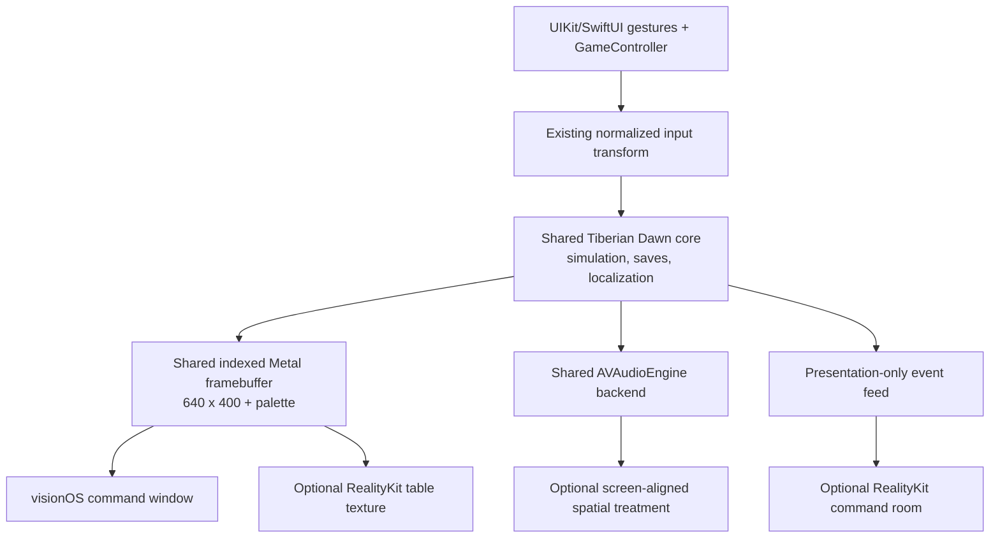

# Apple Vision Pro port concept

Status: documented design direction; no native visionOS target is enabled yet.

## Design principle

The port must preserve Tiberian Dawn as the same 1995 strategy game. It must
not change simulation rules, map visibility, unit behavior, hit testing, save
compatibility, or competitive information. visionOS enhances how the original
2D framebuffer, controls, sound, and surrounding atmosphere are presented.

The safest product is layered:

1. make the existing iPad app reliable as a `Designed for iPad` compatible app;
2. ship a native visionOS window with the same engine and feature set;
3. add an optional volumetric tactical-table presentation;
4. add restrained mixed-immersion and spatial audio around the unchanged game.

The default always remains a movable, resizable window in the Shared Space.
Immersion is an explicit choice and can be exited at any time.

## Experience modes

### 1. Command window — minimum viable port

The complete game runs on a crisp 16:10 surface in a normal visionOS window.
The player can move and resize it in the Shared Space. Existing sharp,
pixel-exact, classic, modern-art, cursor, language, and UI-scale settings remain
available.

Input maps to the current engine coordinates:

- look and pinch performs the normal primary selection at the system-delivered
  location;
- pinch-drag performs selection rectangles and scroll interactions;
- a system-supported secondary gesture or an accessible native command invokes
  cancel/secondary click;
- Bluetooth mouse, trackpad, keyboard, and supported game controllers remain
  first-class alternatives;
- controller events are captured only while the player is looking at the game
  content, following visionOS focus behavior.

The app does not request raw eye-tracking data. Standard UIKit/SwiftUI focus,
hover, and gesture delivery provides interaction while the system protects gaze
privacy.

Native ornaments below or beside the game window may expose Pause, Game
Controls, Visual Controls, keyboard/chat, and an Immersion toggle. They must not
cover the 640-by-400 game surface or replace a command that is available in the
classic UI.

### 2. Tactical table — optional volume

The original framebuffer becomes a texture on a shallow, slightly tilted
virtual command table in a volumetric window. This is still the same 2D game:
there are no 3D units, hidden information, altered camera, or simulation
changes.

Implementation requirements:

- share or copy the indexed Metal output into a RealityKit-compatible texture
  without reading every frame back through the CPU;
- preserve the selectable sharp/nearest filtering policy;
- ray-map a system gesture onto the table plane, then pass normalized
  coordinates through the existing render/input transform;
- keep a front-facing reset action and minimum physical size so perspective
  never makes precise selection unusable;
- keep menus and videos on a stable upright plane if a tilted table harms
  legibility;
- pause input while the volume is being moved or resized.

The table can have an original, project-created frame, subdued GDI/Nod color
accents, and noninteractive radar-style details. It may not distribute or
derive commercial packaging artwork for the public app.

### 3. Command room — optional mixed immersion

Opening a progressive or mixed `ImmersiveSpace` places restrained, decorative
command-room elements around the stable game window/table. Suitable effects
include:

- a dimmable environment that improves contrast without hiding the real room
  by default;
- subtle project-created radar light, status panels, or faction-colored
  illumination reacting to high-level states such as menu, briefing, battle,
  victory, and defeat;
- an optional model of a command console or holographic table around the game
  surface;
- spatially anchored ambience with conservative brightness and motion.

These effects consume a small presentation-only event feed. They never read or
modify fog of war, enemy state, random numbers, commands, or simulation timing.
Disabling immersion must remove all decorative work and leave the engine in the
same state.

A fully immersive VR battlefield is specifically not the goal. Rebuilding the
map and units in 3D would be a new renderer/game interface, introduce gameplay
ambiguity, require extensive new copyrighted assets, and undermine parity with
iPad and Mac.

### 4. Spatial audio

Audio keeps its gameplay meaning:

- music, EVA speech, briefings, and UI sounds remain stable channel/head-relative
  sources;
- tactical effects may use the engine's existing pan value to place sound
  along the game screen or table, after the shared AVAudioEngine backend first
  starts honoring that currently unused pan parameter;
- optional command-room ambience uses RealityKit ambient/spatial audio and
  project-created material;
- no effect becomes so directional or quiet that a player misses information
  available on iPad or Mac;
- a `Classic audio` switch disables all spatial treatment instantly.

RealityKit spatial sources are mono and position-dependent, so original stereo
music must not be naively attached to a point entity. Speech and music stay in
the shared audio mix unless a dedicated, validated spatial treatment exists.

## Technical architecture

The long-term native app should make the engine callable from a platform host
instead of letting SDL own the entire application lifecycle. The refactor is
shared infrastructure, not a visionOS fork:

- build engine/game code as a reusable `TiberianDawnCore` library;
- keep one platform-neutral start/stop/pause/resume interface;
- host the indexed Metal surface in an ordinary native window first;
- add SwiftUI/RealityKit scenes only around that proven surface;
- pass input and presentation events through narrow C/C++ bridges;
- keep imports, saves, localization, networking, and settings shared with the
  other Apple targets.

The vendored SDL 2.32 source contains visionOS platform support, but the
project's custom scene patch and build logic are iPad-specific. The native
target must audit upstream SDL visionOS behavior rather than applying the iPad
patch blindly. SDL remains useful for shared input and fallback presentation;
the SwiftUI/RealityKit shell owns spatial scenes.

## Build-system plan

### Compatibility target

Xcode 15 and later can run an iOS/iPadOS binary at the `Designed for iPad`
Apple Vision destination. This is the first test target and requires no native
visionOS code. It validates startup, importer, game window, touch-event
translation, audio, saves, videos, and lifecycle behavior.

Passing in Simulator is not sufficient. Eye/hand comfort, controller focus,
sound, text legibility, and headset removal require a physical Vision Pro.

### Native target

Add explicit, separate configuration rather than disguising visionOS as iOS:

- `VISIONOS_PORT` compile definition;
- `visionos-simulator` using `CMAKE_SYSTEM_NAME=visionOS` and `xrsimulator`;
- `visionos-device` using the `xros` SDK;
- CMake 3.28 or newer for the native visionOS system name;
- a separate generated Xcode project/product directory;
- `Info-visionOS.plist.in`, asset catalog, bundle identifier, signing preset,
  and privacy manifest;
- arm64 only; no Universal 2 requirement;
- the same `NETWORKING` feature gate and game-data exclusion rules as iPad and
  Mac.

The initial native target links only what the command window needs. RealityKit
and SwiftUI enter when the spatial shell is added, not as a prerequisite for
the first engine compile.

## Platform behavior

### Window and presentation

- Start in Shared Space with a comfortable wide window.
- Retain the original 16:10 content aspect without distortion.
- Set tested minimum and maximum sizes; show a native warning below the minimum
  useful game scale.
- Do not attach the game surface to the player's head.
- Do not move, pulse, or tilt the surface in response to combat.
- Keep videos and menus stable and readable at the same logical coordinates.

### Lifecycle

visionOS can leave unfocused windows visible and dimmed. The engine must not
assume visible means active. Stop commands and throttle presentation when the
scene loses active focus, but preserve the last frame. Pause audio and gameplay
for headset removal or scene suspension using the same lifecycle state machine
as iPadOS.

For multiplayer, loss of active focus invokes the documented synchronized
pause/grace-period policy; it never lets the local simulation continue alone.

### Data import and saves

Keep the legal-data model unchanged. The user supplies GDI and Nod C&C Gold
ISOs or a prepared directory through a system document picker. Import remains
local, transactional, and excluded from backup where appropriate. Saves remain
user-exportable through native document UI and compatible with iPad/macOS when
the original engine format permits it.

### Accessibility and comfort

- Provide German and English native labels and VoiceOver descriptions.
- Use system hover effects for native controls; never infer or log gaze.
- Preserve large cursor/high contrast and scalable UI.
- Offer a fully windowed, nonimmersive path to every feature.
- Keep immersion gradual, seated-friendly, low-motion, and reversible.
- Avoid very dark/bright surrounds, rapid full-field flashes, artificial
  locomotion, or content that requires turning behind the player.
- Provide clear Exit Immersion, Recenter Table, Pause, and Classic Audio
  actions.

## Implementation milestones and gates

### V0 — Designed-for-iPad compatibility spike

- Add the Apple Vision compatible destination to the generated iPad project if
  necessary and launch in Vision Simulator.
- Audit UIKit idiom/orientation assumptions, custom SDL touch delivery, hover,
  document pickers, AVAudioSession, videos, controller input, and paths.
- Record every unsupported or degraded feature instead of adding spatial work.

Gate: import through a live mission works in the compatible window without a
crash, black frame, incorrect coordinates, or inaccessible exit.

### V1 — native command window

- Add native CMake presets, platform bridge, Info.plist, resources, CI compile,
  and signing path.
- Refactor the engine entry point only as much as necessary for a native host.
- Bring shared Metal, AVAudioEngine, localization, import, save transfer,
  modern art, scaling, controls, and multiplayer feature flags to parity.

Gate: the native app passes campaigns, videos, input, saves, lifecycle, audio,
and resizing in Simulator and on physical hardware. Until then, the compatible
iPad app remains the supported Vision Pro route.

### V2 — spatial interaction polish

- Add native ornaments, hover treatment, controller event interaction, and
  accessible secondary-click/cancel controls.
- Validate look/pinch, drag selection, scrolling, keyboard, mouse/trackpad, and
  controllers without changing engine hit testing.

Gate: touch-equivalent tasks are no slower or less reliable than the compatible
window in a repeatable mission test.

### V3 — tactical table prototype

- Share the Metal framebuffer with RealityKit, implement plane-coordinate
  mapping, stable menu/video presentation, reset/recenter, and table resources.
- Profile copy cost, latency, sharpness, thermal behavior, and precision.

Gate: optional table mode stays checksum-neutral, adds no more than one frame
of input-to-present latency, and remains comfortable during a 60-minute mission.

### V4 — command room and spatial audio

- Add progressive mixed immersion and a presentation-only state feed.
- Restore shared effect panning before mapping tactical sound to screen space.
- Add conservative original ambience and Classic Audio/No Immersion fallbacks.

Gate: no gameplay information is added or lost, all immersion is optional, and
physical-device comfort/audio acceptance passes.

### V5 — release

- Add visionOS to CI, parity documentation, privacy review, crash-symbol flow,
  TestFlight group, store media, and release checklist.
- Test cross-play with iPad and Mac when multiplayer is enabled.

Gate: a native visionOS release is not announced until it passes on physical
Vision Pro hardware. A Simulator-only result is a prototype, not a port.

## Verification matrix

- Designed-for-iPad and native builds in Vision Simulator;
- physical Vision Pro cold launch, import, videos, mission, save/load, relaunch;
- look/pinch, selection drag, pan/scroll, long press or secondary alternative;
- keyboard, mouse, trackpad, and at least one supported controller;
- window resize, reposition, loss/regain focus, headset removal, interruption;
- sharp, pixel-exact, classic, modern-art, high-contrast, and UI-scale modes;
- German/English native UI, VoiceOver, captions/legibility where available;
- classic and spatial audio, Bluetooth route changes, volume and comfort;
- 60-minute table/immersion thermal, memory, frame pacing, and latency soak;
- multiplayer pause and mixed-platform cross-play using the shared networking beta;
- privacy manifest, permissions, signing, TestFlight, and store validation.

## Apple references

- [Making an existing app compatible with visionOS](https://developer.apple.com/documentation/visionos/making-your-app-compatible-with-visionos)
- [Determining whether to build a native visionOS app](https://developer.apple.com/documentation/visionos/determining-whether-to-bring-your-app-to-visionos)
- [visionOS windows, volumes, and immersive spaces](https://developer.apple.com/documentation/visionos)
- [Positioning and sizing windows](https://developer.apple.com/documentation/visionos/positioning-and-sizing-windows)
- [Creating immersive spaces with SwiftUI and RealityKit](https://developer.apple.com/documentation/visionos/creating-immersive-spaces-in-visionos-with-swiftui)
- [Creating fully immersive experiences](https://developer.apple.com/documentation/visionos/creating-fully-immersive-experiences)
- [Game Controller on visionOS](https://developer.apple.com/documentation/gamecontroller/discovering-game-controllers)
- [visionOS privacy and system-provided gaze/gesture handling](https://developer.apple.com/documentation/visionos/adopting-best-practices-for-privacy)
- [RealityKit spatial audio](https://developer.apple.com/documentation/realitykit/spatialaudiocomponent)
- [Apple Vision Pro App Store compatibility](https://developer.apple.com/help/app-store-connect/manage-your-apps-availability/manage-availability-of-iphone-and-ipad-apps-on-apple-vision-pro)
